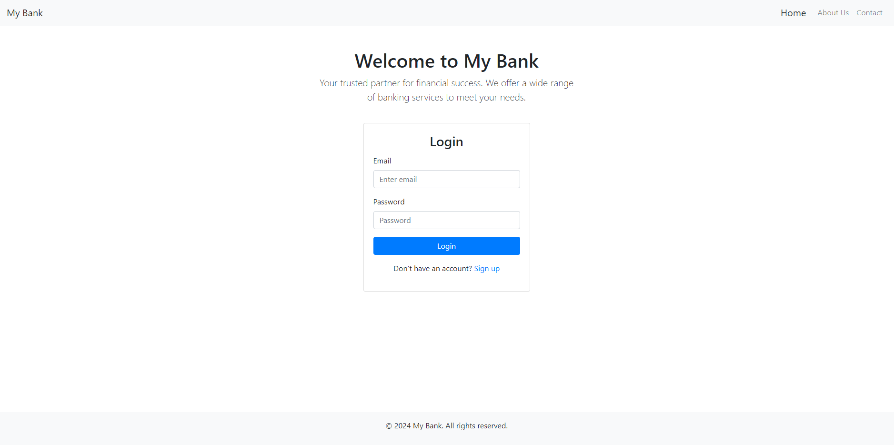
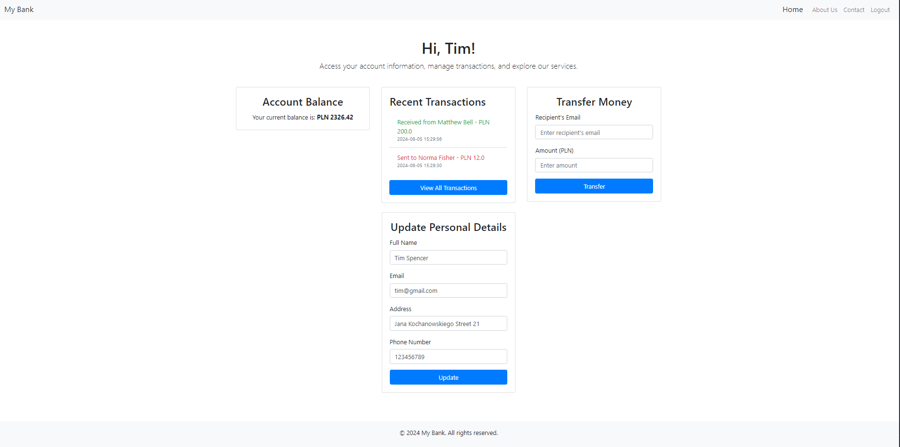
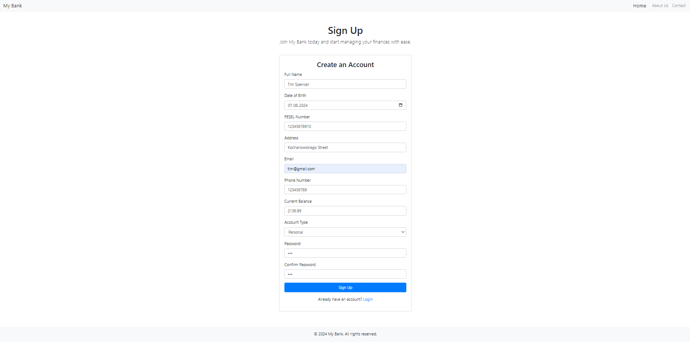
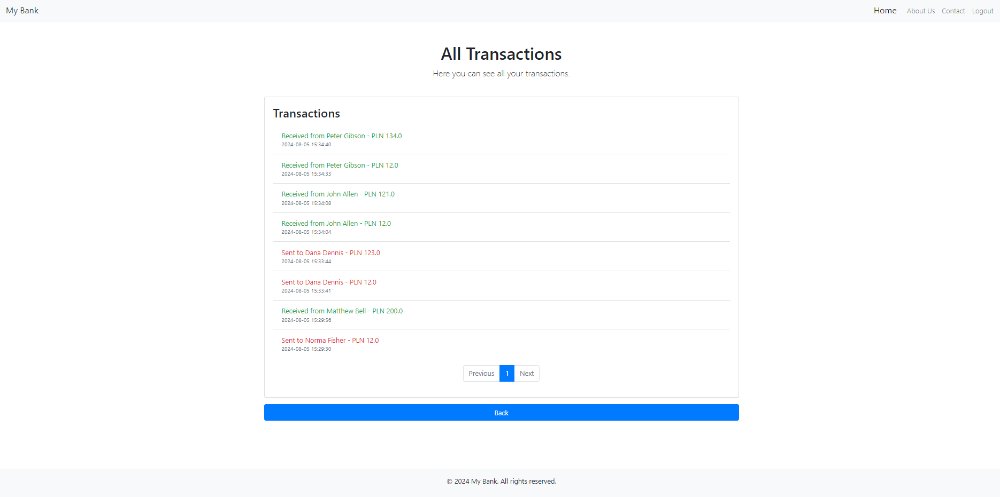

# **Bank App with Flask**

## Table of Contents

- [Project Description](#project-description)
- [Features](#features)
- [Project Structure](#project-structure)
- [Screenshots](#screenshots)
- [Requirements](#requirements)
- [Setup](#setup)
  - [Using Docker](#using-docker)
  - [Using Git Clone](#using-git-clone)
- [Usage](#usage)
- [Running Tests](#running-tests)

## Project Description

This project is a **web application** designed to provide a basic **banking experience**. It features **user authentication**, **database interactions**, and a variety of **web pages** for user interaction. On the first run, the application creates a database using **SQLAlchemy** and populates it with fake user data. You can log in to any of the pre-created email accounts using their corresponding name and a password, which is set to `123`. Additionally, users can register a new account. Once logged in, users can **transfer money between accounts**, **update their information**, and **view all transactions**.

## Features

- **User authentication** and authorization
- Dynamic web pages using templates via **Jinja2**
- Database interactions for storing user data using **SQLAlchemy**
- **Responsive design** with static files (CSS and JS)
- **Docker** support for easy deployment
- Comprehensive testing suite with **Pytest**

## Project Structure

```
project-root/
├── .dockerignore
├── .gitignore
├── Dockerfile
├── main.py
├── requirements.txt
├── test/
│   ├── conftest.py
│   ├── test_project.py
│   └── __init__.py
└── website/
    ├── fill_db.py
    ├── models.py
    ├── __init__.py
    ├── instance/
    │   └── users.db
    ├── static/
    │   ├── scripts.js
    │   └── style.css
    ├── templates/
    │   ├── about.html
    │   ├── all_transactions.html
    │   ├── base.html
    │   ├── contact.html
    │   ├── home.html
    │   ├── signup.html
    │   └── user.html
    └── views/
        ├── auth.py
        ├── misc.py
        ├── user.py
        └── __init__.py
```

## Screenshots

*Home Page*:


*User Dashboard*:


*Sign Up Page*:


*All transactions Page*:


## Requirements

- **Python 3.x**
- **Docker** (for Docker setup)
- Other dependencies listed in `requirements.txt`

## Setup

### Using Docker

1. Build the Docker image:
   ```
   docker build -t project_name .
   ```

2. Run the Docker container:
   ```
   docker run -d -p 5000:5000 project_name
   ```

3. Access the application at `http://localhost:5000`.

### Using Git Clone

1. Clone the repository:
   ```
   git clone https://github.com/MlCHAL-S/FlaskBankApp.git folder_name
   cd folder_name
   ```

2. Install the dependencies:
   ```
   pip install -r requirements.txt
   ```

3. Run the application:
   - If using **PyCharm**, open `main.py` and run it.
   - Alternatively, run it from the command line:
     ```
     python main.py
     ```

4. Access the application at `http://localhost:5000`.

## Usage

1. Open the web application in your browser.
2. Sign up for a new account or log in with existing credentials which are stored in **website/instance/users.db** eg. katelynmontgomery@example.com.
3. Navigate through the various pages such as Home, User, About, Contact, etc.
4. Interact with the application as per the available features.

## Running Tests

The project includes a basic set of tests to ensure the correct functionality of the application:

- **Home Page Test**: Checks that the home page loads correctly and displays the appropriate title.
- **Sign Up Test**: Verifies that a new user can be registered, and the data is correctly stored in the database.
- **Login Test**: Confirms that users can log in using valid credentials and are redirected to the appropriate dashboard.

1. Navigate to the project directory:
   ```
   cd folder_name
   ```

2. Run the tests:
   ```
   pytest
   ```